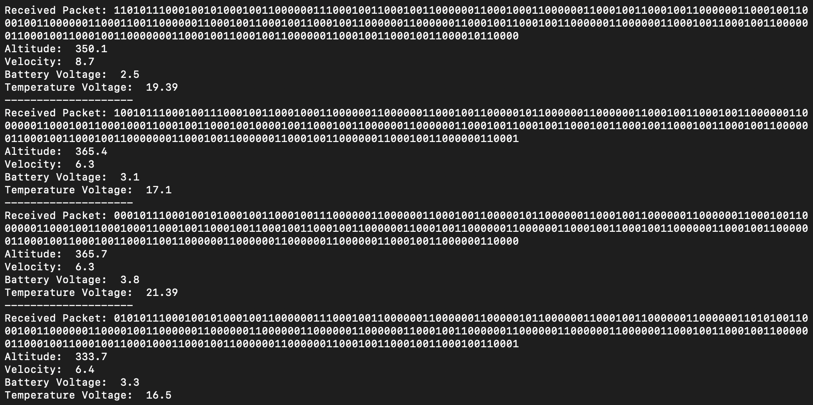

# Satellite Telemetry Simulator


## Satellite


## Ground Station


A basic satellite telemetry simulator that mimics radio communication between a satellite and a ground station using UDP client-server architecture. Random telemetry data is generated, a single bit is flipped to simulate transmission errors, and is corrected using Hamming error correction.

## Overview

The satellite generates random telemetry data using `numpy.random`, converts to binary, encodes with hamming error correction and transmits over UDP after flipping single random bit to simulate real-world communication errors. 

The ground station (server) receives the data, detects and corrects the error using Hamming code, and decodes the telemetry for display.

- **Altitude** (12 bits)
- **Velocity** (7 bits)
- **Voltage** (7 bits)
- **Temperature** (12 bits)


## Features

- **UDP Communication**: Simulates satellite-to-ground radio communication using UDP client (satellite) and server (ground station).
- **Random Telemetry**: Produces random telemetry values for altitude, temperature, velocity, and voltage.
- **Error Simulation**: Introduces a random single-bit error in the transmitted data to mimic noise or interference.
- **Hamming Error Correction**: Implements Hamming code to detect and correct single-bit errors at the ground station.
- **Binary Encoding**: Telemetry data is packed into a binary format with specified bit lengths (12, 7, 7, 12).

## Working
1. **Satellite (UDP Client)**:
   - Generates random telemetry data.
   - Encodes the data into a binary string with Hamming parity bits.
   - Flips a random bit to simulate a transmission error.
   - Sends the data to the ground station via UDP.

2. **Ground Station (UDP Server)**:
   - Receives the corrupted binary data.
   - Uses Hamming error correction to detect and fix the single-bit error.
   - Decodes the corrected binary data back into telemetry values.
   - Outputs the results.


## Usage

Super simple:
1. Start the ground station (server):
   ```bash
   python ground_station.py
   ```
2. Run the satellite simulator (client):
   ```bash
   python satellite.py
   ```

